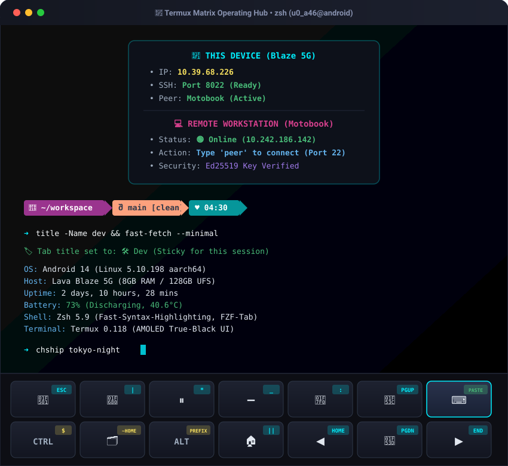
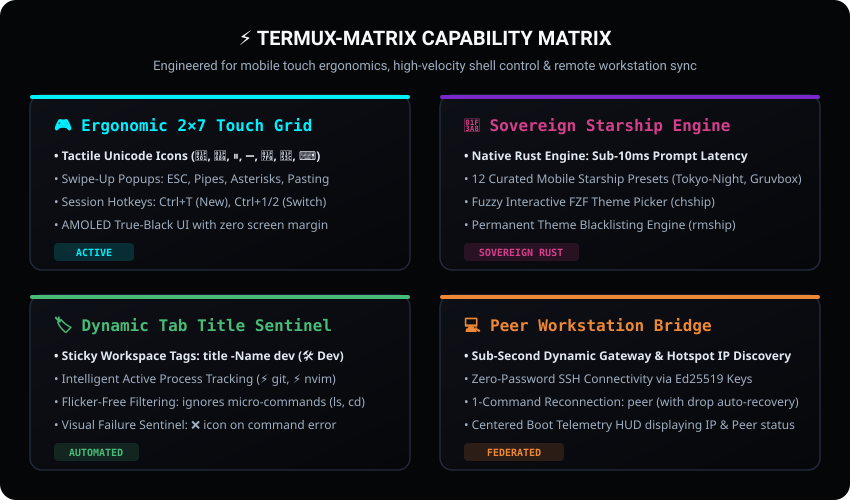

# ⚡ Termux-Workbench: High-Velocity Mobile DevOps & Terminal Workstation

[](https://termux.dev)
[](https://www.zsh.org/)
[](https://starship.rs)
[](./docs/PROFILES.md)
[](./SECURITY.md)
[](./LICENSE)

> **Transform standard Android Termux into an ergonomic, desktop-class mobile development workstation featuring swappable touch-key profiles, a live dual-engine prompt switchboard, dynamic tab title sentinel, modular drop-in shell extensions, and a zero-password peer workstation bridge.**

---

<p align="center">
  
</p>

---

## Quickstart & Installation

Deploy the complete workstation environment to your Android device in 1 command:

```bash
sh -c "$(curl -fsSL https://raw.githubusercontent.com/karansinghverma979/Termux-Workbench/main/install.sh)"
```

> [!TIP]
> **Safety First**: The installer automatically creates a timestamped backup of your existing `~/.termux/`, `~/.zshrc`, `~/.tmux.conf`, and `~/.config/` in `~/.termux_workbench_backup_<timestamp>/`. Nothing is overwritten without backup.

---

## 🏛️ The 5 Core Pillar Systems

<p align="center">
  
</p>

```
┌────────────────────────────────────────────────────────────────────────┐
│                  ⚡ THE TERMUX-WORKBENCH ARCHITECTURE                  │
├───────────────────┬───────────────────┬────────────────────────────────┤
│ 🎮 PROFILE ENGINE │ 🎨 DUAL PROMPT    │ 🏷️ TAB TITLE SENTINEL          │
│ Swappable Touch   │ Live Switch:      │ Dynamic Context: ⚡ git, ⚡ vim│
│ Grids: Dev, Vim,  │ Starship ◄► P10k  │ Sticky Tags: title -Name dev   │
│ Sysadmin Layouts  │ 12 Mobile Presets │ Error Sentinel: ❌ on failure  │
├───────────────────┴───────────────────┴────────────────────────────────┤
│ 💻 PEER WORKSTATION BRIDGE : Sub-second dynamic IP & hotspot discovery │
│ Zero-password Ed25519 pairing • 1-key reconnect: peer (or motobook)    │
├────────────────────────────────────────────────────────────────────────┤
│ 🧩 MODULAR EXTENSIONS : Drop-in ~/.termux-workbench/modules/*.zsh      │
│ Unified CLI Control: workbench [status | profile | theme | update]     │
└────────────────────────────────────────────────────────────────────────┘
```

---

### 1. 🎮 Swappable Profile Engine (`workbench profile`)

Different tasks demand different touch ergonomics. **Termux-Workbench** lets you switch between specialized extra-key layouts instantly without editing config files:

```bash
workbench profile            # Launches interactive fuzzy picker (FZF)
workbench profile dev        # Standard 2×7 Touch Grid (Tactile Unicode icons)
workbench profile vim        # Modal Editing Grid (:w, :wq, Esc, hjkl navigation)
workbench profile sysadmin   # Remote Server Grid (Sudo, pipes, SSH, background signals)
```

```
┌─────────────┬─────────────┬─────────────┬─────────────┬─────────────┬─────────────┬─────────────┐
│  [ESC]      │  [ | ]      │  [ * ]      │  [ _ ]      │  [ : ]      │  [PGUP]     │  [PASTE]    │
│     ▲       │     ▲       │     ▲       │     ▲       │     ▲       │     ▲       │     ▲       │
│    🔁       │    🚀       │    ⏸️       │    ➖       │    🟰       │    🔼       │    ⌨️       │
│   (TAB)     │    ( / )    │   ( ' )     │    ( - )    │    ( = )    │    (UP)     │ (KEYBOARD)  │
├─────────────┼─────────────┼─────────────┼─────────────┼─────────────┼─────────────┼─────────────┤
│  [ $ ]      │  [$HOME/]   │  [$PREFIX/] │  [ || ]     │  [HOME]     │  [PGDN]     │  [END]      │
│     ▲       │     ▲       │     ▲       │     ▲       │     ▲       │     ▲       │     ▲       │
│   CTRL      │    🗂️       │    ALT      │    🏠       │    ◀️       │    🔽       │    ▶️       │
│             │  (DRAWER)   │             │   (&&)      │   (LEFT)    │   (DOWN)    │   (RIGHT)   │
└─────────────┴─────────────┴─────────────┴─────────────┴─────────────┴─────────────┴─────────────┘
```

* **Atomic Swipe-Up Popups**: Swipe up on `TAB` for `ESC`; swipe up on `KEYBOARD` for instantaneous clipboard `PASTE`; swipe up on `UP` for `Page Up`.
* **AMOLED True-Black UI**: Zero margin padding (`0px`) maximizes vertical terminal real estate.
* **Hardware Session Shortcuts**: `Ctrl + T` (New Tab), `Ctrl + 1` / `Ctrl + 2` (Previous/Next Tab), `Ctrl + N` (Rename Tab).
* 📖 *Read the complete breakdown in [docs/TOUCH_KEY_MATRIX.md](docs/TOUCH_KEY_MATRIX.md) and [docs/PROFILES.md](docs/PROFILES.md).*

---

### 2. 🎨 Dual-Engine Prompt Suite (Starship ◄► Powerlevel10k)

Seamlessly transition between prompt engines without restarting your shell:

```bash
use-starship    # Instant switch to Starship
use-p10k        # Instant switch to Powerlevel10k
```

* **Interactive Fuzzy Theme Pickers**:
  * Run `chship` (or `workbench theme`) to launch a fuzzy `fzf` picker across **12 curated mobile themes** (`tokyo-night`, `catppuccin-powerline`, `gruvbox-rainbow`, `bracketed-segments`, `pure-preset`, `jetpack`, etc.).
  * Run `chp10k` to switch Powerlevel10k presets or trigger the configuration wizard.
* **Smart Theme Blacklisting Engine**:
  * Run `rmship` (or `rmp10k`) on any theme you dislike. It will permanently blacklist the preset in `~/.config/*_disliked.txt` and rotate to an alternative sleek theme.

---

### 3. 🏷️ Workspace Tab Title Sentinel

Keep complex multitasking sessions organized across multiple Termux tabs:

* **Sticky Workspace Titles**:
  ```bash
  title -Name dev          # Locks title to "🛠️ Dev"
  title -Name termux       # Locks title to "📲 Termux"
  title                    # Opens interactive FZF title picker
  title reset              # Returns to dynamic automatic tracking
  ```
* **Process-Aware Execution Tracking**: Automatically reflects active commands in the tab bar (`⚡ git`, `⚡ nvim`, `⚡ cargo`, `⚡ python`).
* **Flicker-Free Micro-Filter**: Silently ignores instant micro-commands (`ls`, `cd`, `cat`, `clear`) to eliminate title bar flickering.
* **Error Sentinel**: Automatically prefixes the tab title with `❌` when a command fails.

---

### 4. 💻 Federated Peer Workstation Bridge & Blaze-SSH Link

Seamlessly pair your mobile terminal with your PC or laptop workstation:

```bash
peer                     # Automatically discovers and SSHs into your PC
```

* **Dynamic Network Auto-Discovery**: Probes your mobile hotspot gateway, local Wi-Fi subnet, and cached clients in <200ms without hardcoded IP dependencies.
* **Zero-Password Ed25519 Trust**: Automatically asserts your desktop's public SSH key in `~/.ssh/authorized_keys` for friction-free remote terminal synchronization.
* **Blaze-SSH Companion Bridge ([karansinghverma979/Blaze-SSH](https://github.com/karansinghverma979/Blaze-SSH))**:
  * **Bi-Directional Command Nexus**: While `Termux-Workbench` powers the sovereign mobile Linux environment on your phone (e.g. Lava Blaze 5G), the companion **[Blaze-Termux-SSH](https://github.com/karansinghverma979/Blaze-Termux-SSH)** framework connects from Windows 11 (Motobook) into Termux over port 8022.
  * **Wire-Speed Automation (<4ms Latency)**: Powers desktop automation commands (`blaze`, `blaze-status`, `blaze-clip`, `blaze-location`, `blaze-phone`, `blaze-notifs`, `blaze-wifi`, `blaze-file`, `blaze-media`, `blaze-speak`) with bi-directional clipboard sync, SMS relays, and sensor streaming.
  * **1-Key Remote Handshake**: Run `peer` on Termux to jump into Windows, or run `blaze` on Windows to jump straight into Termux.
* **Connection Drop Recovery**: Automatically traps connection drops when switching networks and guides you back online.
* **Centered Boot Telemetry Radar**: Prints a clean, horizontally centered HUD on terminal launch displaying local device IP, SSH port status, and workstation reachability.
* 📖 *Read the complete companion guide in [docs/BLAZE_TERMUX_SSH.md](docs/BLAZE_TERMUX_SSH.md).*

---

### 5. 🧩 Modular Architecture & The `workbench` CLI

**Termux-Workbench** is designed so you can continuously build and add tools without cluttering your core environment:

```
~/.termux-workbench/modules/
├── 00-core.zsh          # Shell history, completions, and environment exports
├── 10-telemetry.zsh     # Centered boot telemetry radar and SSH supervision
├── 20-titles.zsh        # Sticky workspace tab titles and process-aware tracking
├── 30-prompts.zsh       # Starship & Powerlevel10k theme switchboard & font switcher
├── 40-tmux.zsh          # Session control suite and auto-attach
├── 50-peer-bridge.zsh   # Dynamic workstation auto-discovery and Ed25519 pairing
└── 60-aliases.zsh       # Personal shorthand and productivity aliases
```

#### The `workbench` Command Center
| Command | Description |
| :--- | :--- |
| `workbench status` | Display active profile, prompt engine, active Nerd Font, and peer workstation telemetry. |
| `workbench profile [name]` | Interactive FZF selector or direct switch between `dev`, `vim`, and `sysadmin`. |
| `workbench theme` | Interactive prompt theme switcher (`chship` / `chp10k`). |
| `workbench font [name]` | Interactive FZF selector or direct switch across installed Nerd Fonts (`chfont`). |
| `workbench update` | Pull latest updates from GitHub and reload settings. |
| `workbench backup` | Create a timestamped configuration archive in `~/backups/`. |
| `workbench restore <file>` | Rollback configuration from a backup archive. |

---

## 🛠️ Make It Your Own: Customization & Portability

Termux-Workbench is completely decoupled from machine-specific paths and user credentials:

| File | Purpose | Customization |
| :--- | :--- | :--- |
| [`~/.peer_pc.env`](config/peer_pc.env.example) | Workstation Credentials | Set your PC's IP, username, port, and public key. |
| [`~/.termux/termux.properties`](config/termux.properties) | Touch Extra Keys & UI | Change button icons, swipe-up macros, cursor blink, and colors. |
| [`~/.termux/fonts/`](config/) | Nerd Font Vault | Swappable monospace Nerd Fonts (`MesloLGS`, `JetBrainsMono`, `CaskaydiaCove`). |
| [`~/.nanorc`](config/.nanorc) | Hardened Nano Config | Line numbers, AMOLED styling, smooth scrolling, and tab-to-spaces. |
| [`~/.config/terminal_titles.json`](config/terminal_titles.json) | Tab Title Registry | Add or edit custom workspace tags (`title -Name <k> -Value <v>`). |
| [`~/.tmux.conf`](config/.tmux.conf) | Mobile Tmux Runtime | Touch mouse support, zero escape delay, vim navigation splits. |

👉 **Read the comprehensive guides**:
- [docs/BLAZE_TERMUX_SSH.md](docs/BLAZE_TERMUX_SSH.md) — Companion Hub: Blaze-Termux-SSH Integration & Channels
- [docs/CUSTOMIZATION.md](docs/CUSTOMIZATION.md) — Personalization & Workstation Setup
- [docs/PROFILES.md](docs/PROFILES.md) — Profile Engine & Adding New Workflows
- [docs/TOUCH_KEY_MATRIX.md](docs/TOUCH_KEY_MATRIX.md) — 2×7 Keymap Technical Spec
- [docs/ARCHITECTURE.md](docs/ARCHITECTURE.md) — Subsystem Architecture Deep Dive

---

## 📦 Multi-Pathway Installation & Matrix Management

### Pathway A: 1-Line Automated Installer (Recommended)
```bash
sh -c "$(curl -fsSL https://raw.githubusercontent.com/karansinghverma979/Termux-Workbench/main/install.sh)"
```

### Pathway B: Git Clone & Local Development
```bash
git clone https://github.com/karansinghverma979/Termux-Workbench.git ~/.termux-workbench
cd ~/.termux-workbench
./install.sh
```

### Pathway C: Backup & Disaster Recovery
```bash
workbench backup                 # Creates timestamped .tar.gz in ~/backups/
workbench restore <file.tar.gz>  # Restores configs and reloads shell
```

---

## 📜 Architectural Heritage & Evolution

**Termux-Workbench** is the direct successor to **Project Legacy (2020–2025)**:
* **The 2020–2025 Era (`Termux-Extra-Keys`)**: Born as a personal terminal environment created by Karan Singh Verma. It featured Oh-My-Zsh with the `mira` and `agnoster` themes, the "Queen" / "Sarika" startup protocol, `lolcat` formatting, and early extra-key mappings.
* **The Modern Era (`Termux-Workbench`)**: Evolved into an extensible, profile-driven mobile terminal operating environment. It introduces swappable touch-key profiles, the dual Starship/P10k prompt engine, dynamic workspace tab sentinel, mobile tmux touch suite, and automated peer workstation bridge.
* Read the full version history in [CHANGELOG.md](CHANGELOG.md).
* Historical files are preserved in [`legacy/`](legacy/).

---

## 🔒 Security & Supply Chain Integrity
- **OpenSSF Hardening**: GitHub Actions workflows enforce `permissions: contents: read` with commit SHA pinning.
- **Path Portability**: Zero hardcoded workstation host paths. All host pairing uses dynamic environment variables (`~/.peer_pc.env`).
- **Coordinated Disclosure**: See [SECURITY.md](SECURITY.md).

---

## 📄 License
Released under the [MIT License](LICENSE). Maintained by [Karan Singh Verma](https://github.com/karansinghverma979).
